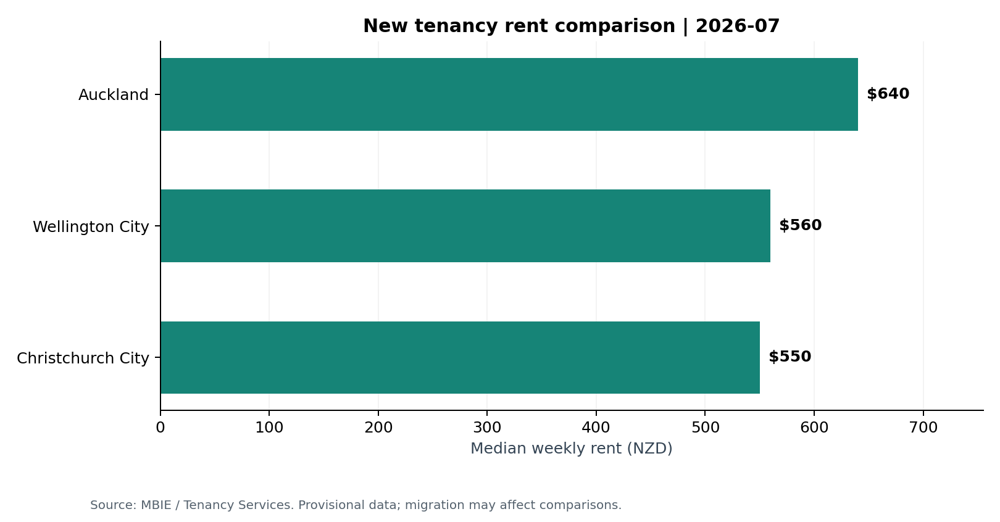
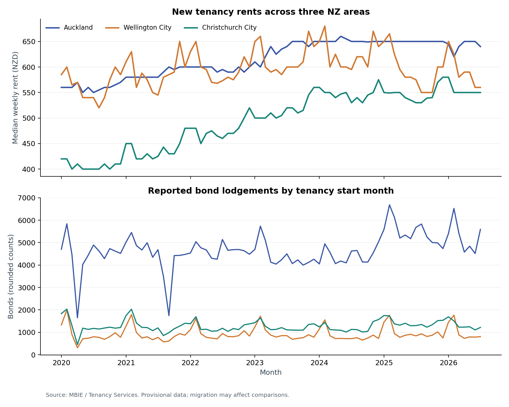

# New Zealand Rental Market Analysis

A reproducible Python and SQL portfolio project exploring new private tenancy rents in New Zealand. It uses published MBIE rental bond data, with no course code or course assignment material.



## Questions

- How do monthly new-tenancy rents differ across Auckland, Wellington City and Christchurch City?
- How has each area's reported median changed from the same month one year earlier?
- Which territorial authorities have the largest latest-month percentage changes?
- How do reported bond lodgements vary over time?

## Snapshot findings

The bundled September 2026 release covers February 1993–July 2026. In July 2026, published median weekly rents were NZ$640 in Auckland, NZ$560 in Wellington City and NZ$550 in Christchurch City. Christchurch's reported median was NZ$530 in July 2025, a 3.77% increase.

**These are descriptive comparisons of provisional data.** MBIE reports system migration and possible revisions, so recent changes may partly reflect reporting changes. They should not be treated as precise market growth estimates or evidence of causation.

See [generated findings](outputs/findings.md) and [data-quality checks](outputs/data_quality.json).



## Run on Windows

Requires Python 3.10 or newer. Open this folder in VS Code, then open a PowerShell terminal:

```powershell
py -m venv .venv
.\.venv\Scripts\python.exe -m pip install -r requirements.txt
.\.venv\Scripts\python.exe python\analysis.py
```

Using the virtual environment's Python directly avoids activation-policy issues. If `py` is unavailable but Python is installed, replace `py` in the first command with `python`.

macOS/Linux:

```bash
python3 -m venv .venv
.venv/bin/python -m pip install -r requirements.txt
.venv/bin/python python/analysis.py
```

The official source snapshot is included. No database server, API key or separate download is required for the first run. Dependency installation requires internet access.

## What happens when you run it

1. pandas reads the official CSV and validates dates, numeric types and unique area/month keys.
2. The pipeline removes national and unallocated-area rows, preserving the original file.
3. Python loads the cleaned records into a local SQLite database.
4. SQL creates views for calendar-year comparisons, annual activity and ranking.
5. Python exports result tables, a findings report and two PNG charts.

| File | Purpose |
| --- | --- |
| `python/analysis.py` | Cleaning, SQLite loading, outputs and charts |
| `sql/rental_analysis.sql` | JOIN, GROUP BY, CASE, CTE and DENSE_RANK queries |
| `data/raw/mbie_monthly_ta_2026-09.csv` | Unmodified official snapshot |
| `outputs/monthly_yoy.csv` | Area/month observations and year-on-year changes |
| `outputs/latest_snapshot.csv` | Latest source month for named TAs |
| `outputs/latest_growth_ranking.csv` | Latest YoY ranking with minimum-count filter |
| `outputs/annual_activity.csv` | Available-month activity and full-year totals |
| `outputs/rental.db` | Generated SQLite database, excluded from Git |
| `tests/test_analysis.py` | Calculation and edge-case checks |
| `START_HERE_CN.md` | Chinese setup and learning guide |

## Methodology

The analysis unit is one month and one territorial authority. `MedianRent` is used as published in this release; the separate geometric mean is retained and is never relabelled as a median. Weekly rents are in nominal NZD.

Year-on-year rent change is `(current median - same-month previous-year median) / previous-year median * 100`. SQL joins dates explicitly: a missing month cannot make the previous available row masquerade as last year. Missing or zero denominators yield missing growth, not infinity.

Monthly medians are **not averaged into an annual median**. The annual table sums bond lodgement counts and reports a full-year total only when all 12 months and counts are present. Active bonds are a stock and are not summed over time. The ranking requires at least 30 reported lodged bonds in both comparison months; this analyst-chosen filter is not a significance test. Ranking uses changes rounded to two decimal places.

The source snapshot contains 26,850 rows. Removing the national aggregate and unallocated location leaves 26,046 named TA observations. Source counts are rounded for confidentiality. Unknown numeric tokens cause a validation error; recognised suppression/blank values remain missing. Missing chart months show gaps.

## Limitations

- New private tenancy rents do not describe the rent of all current tenants.
- Auckland's TA area is geographically broader than Wellington City or Christchurch City.
- Differences in property mix can affect medians. This monthly file has no bedroom or dwelling-type breakdown.
- No adjustment for inflation, income, property quality or seasonal effects is made.
- Recent figures are provisional; MBIE notes system migration and comparability problems.
- Lodgement activity is not a direct estimate of demand, vacancies or population.
- Historical TA coverage can change. This project does not splice former Auckland councils together.

## Refresh the data

Open the [official source page](https://www.tenancy.govt.nz/about-tenancy-services/data-and-statistics/rental-bond-data/) and download **By territorial authority** from the monthly section. Save it under `data/raw/`, then run:

```powershell
.\.venv\Scripts\python.exe python\analysis.py --input data\raw\new_release.csv --start-year 2020
```

The parser accepts the bundled column names and equivalent names with spaces/underscores. It supports D/M/YYYY and ISO YYYY-MM-DD dates. If MBIE changes definitions or schema, review them before adapting the code. Update this README's manually written snapshot paragraph and `data/SOURCE.md` after a refresh; the generated tables, charts and findings update automatically.

## Tests

```powershell
.\.venv\Scripts\python.exe -m unittest discover -s tests -v
```

Tests verify the bundled Christchurch comparison against source values, incomplete-year handling, annual count aggregation, duplicate-key rejection and calendar-month joins. They do not validate MBIE's collection process.

## Source and attribution

Data source: **The Ministry of Business, Innovation and Employment (MBIE)**, published by Tenancy Services. [Rental bond data](https://www.tenancy.govt.nz/about-tenancy-services/data-and-statistics/rental-bond-data/). Data licence: [Creative Commons Attribution 3.0 New Zealand](https://creativecommons.org/licenses/by/3.0/nz/). See [provenance](data/SOURCE.md).

Raw data are unchanged. Cleaned tables, calculations and charts are derived outputs. No MBIE endorsement is implied.

## AI assistance

This initial implementation and documentation were created with AI assistance. The project includes executable checks and traceable source data. Before presenting it as a personal portfolio project, review the code, run it yourself, and be ready to explain and extend the analysis.
